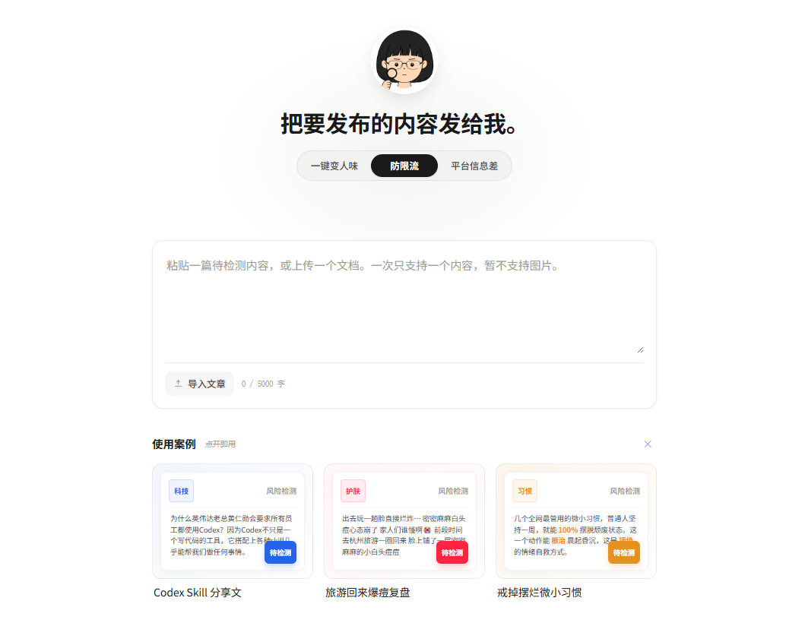

# AI 写稿总被限流？学会去除 AI 写作痕迹，稿件找回真人质感

很多做自媒体、运营博主，手上同时维护好几个账号，日常工作量大，都会借助** AI 来产出初稿**。但随之而来的麻烦也很现实：稿件满身**AI 痕迹**，也就是大家常说的** AI 味**，这类文稿很容易被平台识别，拿不到推荐流量。 于是到处去搜**怎么消除 AI 写作痕迹**，翻各种**去 AI 味网站**，收藏一堆**去除 AI 痕迹指令**，轮番尝试各类**免费去除 AI 痕迹工具**。我自己也踩过不少坑，慢慢才意识到，仅仅替换词语、调换语序，效果十分有限。想要真正把稿件写得自然，核心要从文章结构、行文表达上做调整。

## 一、AI味到底在哪？

我最早修改 AI 生成稿件，习惯上来就批量替换近义词。改完粗看似乎焕然一新，可通篇读完，浓浓的机器感依旧挥之不去。 后来才想明白，问题并不单单出在个别词汇上。**AI 产出的内容**段落篇幅趋于均等，句子节奏高度统一，观点整齐罗列，逻辑顺滑完美，读完很难留下记忆点。 普通人真实写文章不会追求这般规整，时而长句铺叙，时而短句点题，中间还会夹杂个人的感受与小吐槽，这种不那么标准化的表达，才是真人写作的特质。 所以真正做好**去除 AI 写作痕迹**，不是批量替换文本词汇，而是给文字还原普通人的表达习惯。

## 二、系统AI率识别的依据

拆开一篇 **AI 初稿，**最容易暴露机器属性的主要是结构与句式。

**1、文章框架过于模板化：**非常典型的套路：抛出问题→剖析成因→给出对策→工具推荐→结尾总结升华。 AI 特别擅长生成这套范式，如果整篇严格顺着这套逻辑走，每个小标题下篇幅又相差无几，读者读一小段，大致就能预判后文内容。改稿不必死守原始框架，冗余段落可以合并，次要观点适度删减，自己的实操感悟可以多展开写。

**2、句子表达模板化：**这点是最容易被感知到的。 频繁排比堆砌，反复出现 “首先、其次、最后”，大量套用 “不是…… 而是……”“从根本上……”“值得注意的是……” 这类固定句式。通篇充斥这类标准化表达，整篇文章就会充满流水线生成的味道。

## 三、实操工具方案：小橡皮 AI，解决稿件机器味难题

我日常批量处理稿件，习惯从句式、段落、整体语感多维度同步优化，对比多款工具之后，**小橡皮 AI **是我高频在用的工具。 

传送门： [小橡皮](https://xiangpiai.cn/workspace?from=github0901jw)[https://xiangpiai\.cn/](https://xiangpiai.cn/workspace?from=github0901jw)

很多 **AI 初稿**会产出这类句子：“通过合理运用相关工具，可以有效提升内容创作效率，同时降低人工修改成本。” 语法完全没问题，但完全是工具口吻。换成博主真实分享的表达可以是：“找对合适的工具，能帮我们省下不少改稿时间。” 两句话表意一致，阅读感受却天差地别。

**小橡皮 AI **的「一键变人味」功能，专门用来处理这种内容正确，但表达极度模板化的文本，**弱化稿件 AI 痕迹**。 如果你只运营单一账号，优势感受不算突出；但做多账号分发的创作者会体会到便利。小红书、公众号、抖音、知乎的表达语境各不相同，同一套原文直接复用，极易出现内容同质化，有被限流的风险。**小橡皮 AI **可以针对不同平台切换文风，同一套选题快速适配多个渠道，节省大量重复改写时间。

改写过程中每一处调整全部可视化展示，可以看见修改位置与优化说明。长期做内容，也可以参考它的改写逻辑；遇到不符合自己表达习惯的地方，支持撤回、手动二次编辑，不用全盘接收工具输出结果。

另外还有一个很实用的防限流能力。有时候**稿件 AI 味处理**干净，发布依旧没流量，往往是无意识写下隐性极限词、营销话术，人眼很难全部筛查。改写完成后，可以开启风控扫描，提前标记风险表述，这点对经常写推广向文案的创作者，和**去除 AI 写作痕迹**同等重要。

## 四、工具处理之后通读全文

工具只是辅助，不要把** AI 检测**分数当成发布的唯一标尺，不同检测工具给出的结果本身就存在偏差。 全部处理完，建议自己完整读一遍文稿，可以问自己三个简单问题： 

第一，这句话是不是我平时说话会用到的表达？读着别扭就调整。 

第二，这一段是否有留存的必要？单纯凑字数的段落直接删掉。 

第三，文稿里面有没有属于我自己的东西？个人踩坑经历、真实感悟、具体案例，这些是单纯改词换句得不到的。

通篇只有标准答案，没有个人思考的文字，再怎么润色，依旧容易被判定为机器产出。

## 最后小结

AI 本身是很好的创作帮手，做选题、整理素材、搭建初稿框架都可以交给它。真正的坑，是拿到** AI 生成的初稿**，看都不看就直接发布。 我现在固定的工作流：**AI 产出初稿 **→ 工具清理模板机器腔 → 补充个人经历与观点 → 删除重复啰嗦的语句 → 通读校验后发布。 如果日常需要大批量处理稿件，先用工具做一轮粗加工，再人工微调，效率会高很多。所谓**怎么消除 ai 写作痕迹**，并不是把文字改得华丽复杂，而是删掉空话，留下属于你自己的表达。

